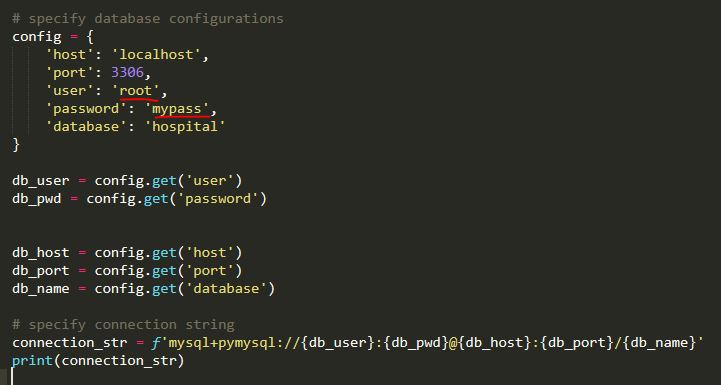

## Project Summary

For our web application / database, we are building a data-aggregator for patients and their medical needs. A patient’s past records and medical history are important. Oftentimes, doctors need to examine past medical history and records to make a more informed decision on a patients’ current needs. Nonetheless, there can be a lot of frustration when organizing your past medical records (and keeping them up-to-date), especially if you have visited multiple hospitals or even different branches of the same hospital.

Final delivery includes data collection, entities and organizational structure, database implementation, UI, and future plan.

For more details, feel free to check final_report.pdf: https://github.com/BachScarlett/Showcase/blob/master/Medical%20Records%20Database%20Application/final_report.pdf

## Getting the Hospital App Up & Running:

1. The database is backed up as a MariaDB .sql file called <em>back.sql</em> in the *Data* folder.
2. Since we all run Python locally, we linked to the MariaDB locally using SQLAlchemy. Username and password information may need to be changed from 'root' and 'mypass' in *index.py* 
3. Our web application is in the main folder as *index.py* We did not have the DockerFile automatically run the python script, so it'll need to run through the command line. 
